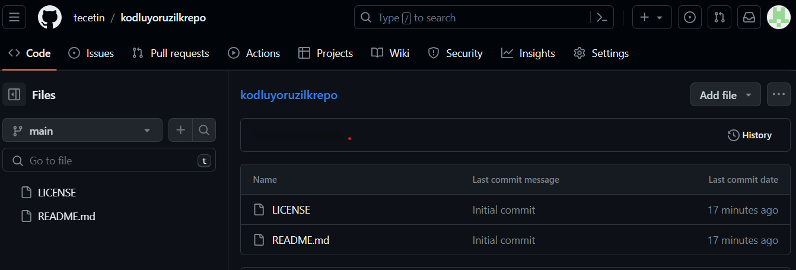

# Kodluyoruz İlk Repo

Bu repo [Kodluyoruz](https://kodluyoruz.org/) Front-End Eğitiminde oluşturduğumuz ilk repo. İçerisinde bir adet README dosyası, bir adet de index.html barındırıyor.



## Reponun Bilgisayara Kurulumu
---
Öncelikle projeyi clonelayın. (Reponuzdan aldığınız link ile)

```bash
git clone https://github.com/tecetin/kodluyoruzilkrepo.git 
```

## Kullanım
---
Projeyi cloneladıktan sonra Visual Studio Code programında açınız.

Windows için;
```vs code
cd kodluyoruzilkrepo
```
***

* Bu kısımlar kopyadır.
## Contributing
Pull requestler kabul edilir. Büyük değişiklikler için, lütfen önce neyi değiştirmek istediğinizi tartışmak için bir konu açınız.


## License
[MIT](https://choosealicense.com/licenses/mit/)